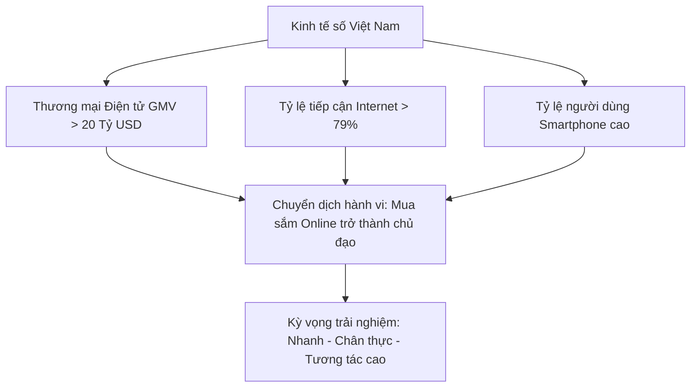
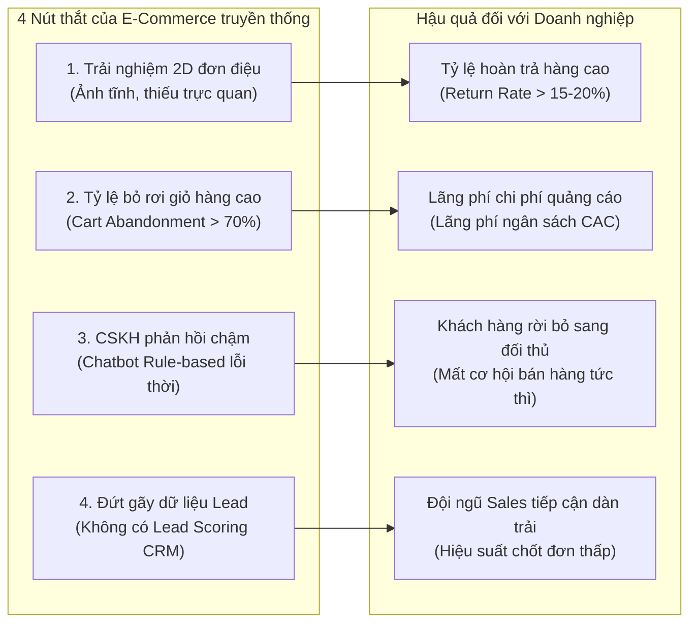
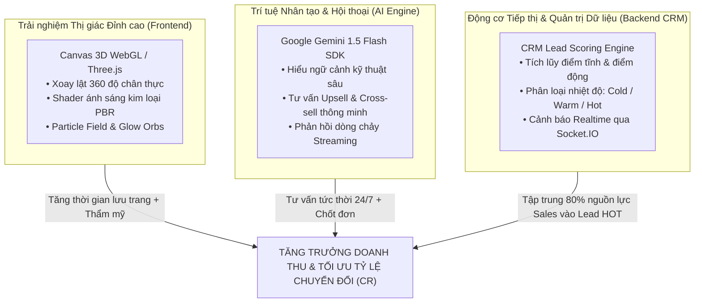
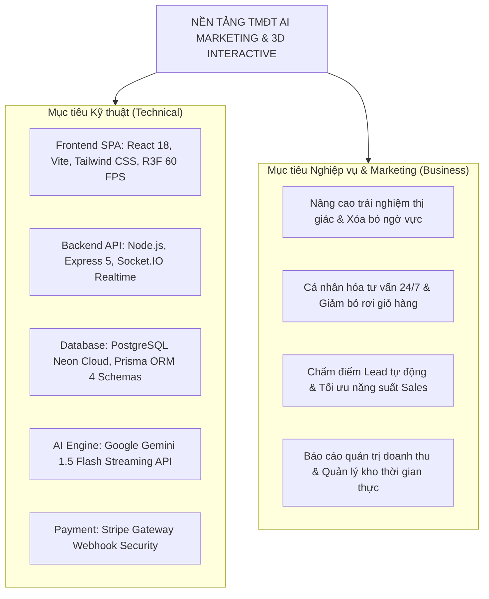
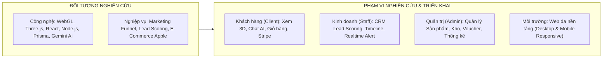
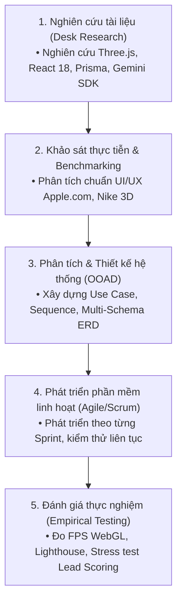
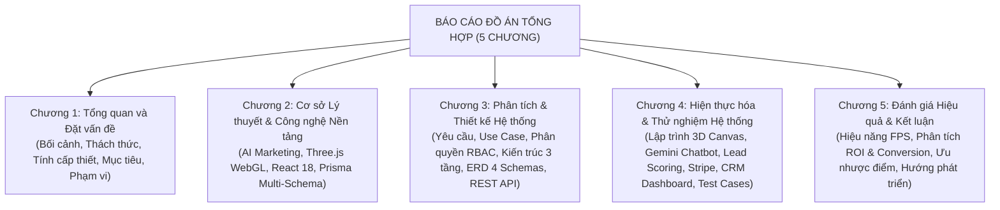

# CHƯƠNG 1: TỔNG QUAN VÀ ĐẶT VẤN ĐỀ

---

## 1.1. Bối cảnh thị trường Thương mại Điện tử và Xu hướng Bán lẻ Công nghệ

### 1.1.1. Thực trạng phát triển của ngành TMĐT toàn cầu và Việt Nam
Trong thập kỷ vừa qua, thị trường Thương mại Điện tử (E-Commerce) toàn cầu nói chung và tại Việt Nam nói riêng đã chứng kiến sự tăng trưởng mang tính bùng nổ. Theo các báo cáo thống kê kinh tế số thường niên của Google, Temasek và Bain & Company (*e-Conomy SEA Report*), quy mô nền kinh tế số Đông Nam Á đã vượt mốc 200 tỷ USD tổng giá trị hàng hóa (GMV), trong đó thương mại điện tử tiếp tục giữ vai trò là động lực tăng trưởng then chốt với tốc độ tăng trưởng kép hàng năm (CAGR) duy trì trên mức 16-20%.

Tại Việt Nam, với dân số trẻ, tỷ lệ phủ sóng Internet đạt trên 79% và tỷ lệ người dùng sử dụng điện thoại thông minh (smartphone) thuộc nhóm cao nhất khu vực, thói quen mua sắm trực tuyến đã trở thành một phần không thể thiếu trong đời sống thường nhật. Sự chuyển dịch mạnh mẽ từ các cửa hàng bán lẻ truyền thống (Brick-and-Mortar) sang các kênh mua sắm kỹ thuật số đã định hình lại toàn bộ hành vi tiêu dùng của xã hội hiện đại.


*Hình 1.1: Xu hướng phát triển kinh tế số và sự chuyển dịch kỳ vọng của người tiêu dùng trực tuyến*

### 1.1.2. Đặc thù tâm lý và hành vi tiêu dùng trong phân khúc thiết bị công nghệ cao
Đặc biệt, trong phân khúc bán lẻ các thiết bị công nghệ cao cấp — tiêu biểu là hệ sinh thái phần cứng của Apple (bao gồm iPhone, iPad, MacBook, iMac, AirPods, Apple Watch cùng các dòng phụ kiện chuyên dụng) — tâm lý và hành vi của người tiêu dùng có những đặc thù rất rõ rệt:

1. **Giá trị đơn hàng cao (High Average Order Value - AOV):** Mỗi sản phẩm công nghệ cao cấp có mức giá dao động từ vài triệu đến hàng chục, thậm chí hàng trăm triệu đồng. Khách hàng không mua sắm theo cảm xúc bộc phát tức thì mà trải qua một quá trình cân nhắc kỹ lưỡng (High-Involvement Purchase).
2. **Nhu cầu thẩm mỹ và trải nghiệm xúc giác - thị giác cao:** Người mua thiết bị công nghệ đòi hỏi được ngắm nhìn chi tiết các góc cạnh, màu sắc khung vỏ (như Titanium tự nhiên, Titan sa mạc, Space Black, Starlight), độ mỏng của viền màn hình và vị trí các cổng kết nối vật lý.
3. **Yêu cầu tư vấn kỹ thuật chính xác và tức thì:** Khách hàng luôn có nhu cầu so sánh cấu hình phần cứng (ví dụ: chip xử lý Apple Silicon M1/M2/M3/M4 so với A-series Bionic, dung lượng RAM Unified Memory, chuẩn sạc Thunderbolt), chính sách bảo hành, khả năng tương thích của hệ sinh thái và các chương trình trợ giá/thu cũ đổi mới.

```
┌─────────────────────────────────────────────────────────────────────────────┐
│              HÀNH TRÌNH TÂM LÝ KHÁCH HÀNG MUA HÀNG CÔNG NGHỆ CAO            │
├─────────────────────────────────────────────────────────────────────────────┤
│ 1. NHẬN THỨC (Awareness)    │ Xem thông tin ra mắt sản phẩm mới (iPhone/Mac)│
│ 2. CÂN NHẮC (Consideration) │ So sánh cấu hình, màu sắc, dung lượng, giá cả │
│ 3. NGHI NGỜ (Hesitation)    │ Lo ngại về màu sắc thực tế, kích thước thực   │
│ 4. TƯ VẤN (Consultation)    │ Cần giải đáp kỹ thuật: RAM, Chip, Hệ sinh thái│
│ 5. QUYẾT ĐỊNH (Decision)    │ Chốt đơn khi được tư vấn đúng & trải nghiệm rõ│
└─────────────────────────────────────────────────────────────────────────────┘
```

### 1.1.3. Xu hướng chuyển dịch công nghệ: Từ hiển thị tĩnh sang trải nghiệm không gian
Trước sự cạnh tranh gay gắt từ hàng ngàn sàn thương mại điện tử và trang web bán hàng, người tiêu dùng ngày càng trở nên khó tính và có xu hướng rời bỏ website nhanh chóng nếu không tìm thấy trải nghiệm mua sắm hấp dẫn, chân thực và được hỗ trợ kịp thời. Xu hướng bán lẻ công nghệ toàn cầu đang dịch chuyển theo 3 trục chính:
- **Immersive 3D Experience (Trải nghiệm Không gian 3D):** Thay thế các bức ảnh 2D tĩnh bằng các mô hình 3D tương tác đa chiều, cho phép xoay, lật, phóng to thu nhỏ và quan sát chân thực từng chi tiết vật lý.
- **Conversational AI & Personalization (AI Đàm thoại Cá nhân hóa):** Tích hợp trợ lý ảo thông minh có khả năng hiểu ngữ cảnh sâu để tư vấn kỹ thuật 24/7 thay vì các chatbot phản hồi theo kịch bản cứng nhắc.
- **Data-Driven CRM & Behavioral Marketing (Marketing Dựa trên Dữ liệu Hành vi):** Ghi nhận từng tương tác vi mô của người dùng trên website để tự động tính toán điểm số tiềm năng (Lead Scoring), phục vụ cho việc chăm sóc bán hàng trúng đích.

---

## 1.2. Những thách thức và nút thắt cốt lõi của E-Commerce truyền thống

Mặc dù các nền tảng thương mại điện tử thế hệ cũ (Web 2.0 truyền thống) đã làm rất tốt việc số hóa danh mục hàng hóa và quy trình đặt hàng cơ bản, nhưng chúng đang bộc lộ những nút thắt nghiêm trọng khi ứng dụng vào phân khúc sản phẩm công nghệ cao:


*Hình 1.2: Các nút thắt của TMĐT truyền thống và hậu quả kinh doanh đối với doanh nghiệp*

### 1.2.1. Giới hạn về trải nghiệm thị giác 2D tĩnh và tác động đến quyết định mua hàng
Việc chỉ hiển thị ảnh chụp dạng JPG/PNG 2D khiến người mua không thể cảm nhận được vẻ đẹp không gian thực tế của sản phẩm. Người dùng không thể tự do xoay 360 độ, không thể phóng to xem chi tiết bề mặt hoàn thiện của kim loại hay mặt kính, dẫn đến sự ngờ vực trong quyết định thanh toán. Khi nhận hàng thực tế không giống như hình dung từ ảnh phẳng 2D, tỷ lệ hoàn trả hàng (Return Rate) tăng vọt, gây tổn thất lớn về chi phí vận chuyển, đóng gói và lưu kho cho doanh nghiệp.

### 1.2.2. Vấn đề bỏ rơi giỏ hàng (Cart Abandonment) và sự thiếu hụt trợ lý tư vấn tức thời
Các nghiên cứu của *Baymard Institute* chỉ ra rằng trên 70% giỏ hàng trực tuyến bị bỏ rơi trước khi thanh toán. Trong phân khúc thiết bị công nghệ, lý do phổ biến nhất là khách hàng còn do dự về cấu hình phần cứng (ví dụ: phân vân giữa 8GB RAM hay 16GB RAM, chip M3 hay M4), chưa rõ phiên bản bộ nhớ nào phù hợp với công việc hàng ngày, hoặc băn khoăn về phụ kiện đi kèm mà không có ai giải đáp ngay tại thời điểm đó.

```
┌─────────────────────────────────────────────────────────────────────────────┐
│                    NGUYÊN NHÂN GÂY BỎ RƠI GIỎ HÀNG TRỰC TUYẾN                │
├──────────────────────────────────────────────────────────┬──────────────────┤
│ Phân vân về thông số kỹ thuật và độ tương thích thiết bị │ 38%              │
│ Thiếu tư vấn giải đáp tức thời về bảo hành / quà tặng    │ 27%              │
│ Nghi ngờ về màu sắc, chất liệu và kích thước thực tế     │ 21%              │
│ Quy trình thanh toán phức tạp hoặc thiếu phương thức uy tín│ 14%             │
└──────────────────────────────────────────────────────────┴──────────────────┘
```

### 1.2.3. Hạn chế của hệ thống Chatbot Rule-Based cổ điển
Phần lớn các website bán hàng hiện nay sử dụng chatbot theo kịch bản tĩnh (Rule-based Bot) với các câu trả lời định sẵn dạng cây quyết định (Decision Tree) hoặc dựa trên từ khóa khớp chính xác (Exact Keyword Matching). 
- Khi khách hàng hỏi một câu vượt ngoài từ khóa cố định, bot thường trả lời "Xin lỗi, tôi không hiểu câu hỏi của bạn" hoặc đẩy sang nhân viên hỗ trợ đang offline.
- Chatbot truyền thống không có khả năng hiểu ngữ cảnh phức tạp (ví dụ: *"Tôi làm đồ họa 3D và render video 4K thì nên chọn MacBook Pro M3 Pro 18GB hay M3 Max 36GB?"*).
- Điều này tạo ra sự bực bội, làm đứt gãy hành trình mua sắm và đẩy khách hàng sang tìm kiếm tại các cửa hàng của đối thủ cạnh tranh.

### 1.2.4. Sự đứt gãy giữa dữ liệu tiếp thị trực tuyến và quản trị khách hàng tiềm năng (CRM Lead)
Khi người dùng truy cập web, xem đi xem lại một chiếc iPhone 16 Pro Max hay MacBook Pro nhiều lần, thêm vào giỏ hàng rồi rời đi, hệ thống TMĐT truyền thống chỉ xem đây là một phiên duyệt web ẩn danh (Anonymous Web Session). 
- Doanh nghiệp không thu thập và phân tích được các hành vi vi mô (Micro-behaviors) này để phân loại mức độ tiềm năng (Lead Scoring).
- Đội ngũ kinh doanh (Sales Reps) phải gọi điện chăm sóc ngẫu nhiên hoặc gửi email tiếp thị đại trà (spam), gây lãng phí chi phí marketing (CAC) và làm giảm tỷ lệ chuyển đổi (Conversion Rate).

---

## 1.3. Tính cấp thiết của việc tích hợp AI Marketing và Đồ họa 3D Interactive

Để giải quyết triệt để các nút thắt nêu trên, một giải pháp đột phá cần phải kết hợp đồng thời cả **Trải nghiệm thị giác không gian tương tác cao (Front-end 3D Experience)** lẫn **Trí tuệ nhân tạo và Phân tích dữ liệu tự động (Back-end AI & CRM Intelligence)**.


*Hình 1.3: Mô hình giải pháp tam giác vàng: Đồ họa 3D, Trí tuệ nhân tạo AI và Động cơ Lead Scoring CRM*

### 1.3.1. Đột phá từ đồ họa 3D Web thời gian thực (Interactive WebGL / Three.js)
Sự phát triển vượt bậc của công nghệ đồ họa WebGL và thư viện Three.js / React Three Fiber cho phép trình duyệt web render các mô hình 3D phức tạp với hiệu ứng ánh sáng (PBR Lighting), độ bóng kim loại và hoạt ảnh chuyển động mượt mà ở tốc độ 60 khung hình/giây (FPS) mà không cần cài đặt bất kỳ plugin nào:
- Người dùng có thể dùng chuột hoặc cử chỉ cảm ứng để xoay 360 độ mọi góc nhìn của sản phẩm.
- Tương tác mở gập màn hình laptop, quan sát chiều sâu của cụm camera, xem sự thay đổi ánh sáng phản chiếu trên chất liệu vỏ máy.
- Trải nghiệm không gian công nghệ tương lai với các hạt tương tác (Particle Fields) và hiệu ứng ánh sáng tỏa (Glow Orbs), tạo ấn tượng thị giác mạnh mẽ (Visual WOW Effect), từ đó tăng gấp đôi thời gian lưu lại trên trang (Time-on-Site) và kích thích lòng ham muốn sở hữu sản phẩm.

### 1.3.2. Sức mạnh của Trí tuệ Nhân tạo Tạo sinh (Generative AI - Google Gemini)
Sự ra đời của các Mô hình Ngôn ngữ Lớn (LLM) mở ra kỷ nguyên mới cho AI Marketing:
- **Tư vấn ngữ cảnh thông minh:** Trợ lý ảo không chỉ trả lời theo kịch bản cứng nhắc mà có khả năng hiểu sâu ngôn ngữ tự nhiên, so sánh thông số kỹ thuật phức tạp giữa các dòng máy, tư vấn lựa chọn sản phẩm phù hợp với nhu cầu công việc và ngân sách của từng cá nhân.
- **Bán chéo và Bán thêm thông minh (Cross-selling & Upselling):** Khi người dùng chọn mua iPad Pro, AI chủ động phân tích và khuyên dùng thêm Apple Pencil Pro hoặc Magic Keyboard để tối ưu hóa hiệu suất vẽ và soạn thảo văn bản.
- **Phản hồi tức thời dạng dòng chảy (Streaming Response):** Tạo cảm giác trò chuyện tự nhiên với chuyên viên công nghệ thực thụ, hoạt động liên tục 24/7/365 mà không tốn chi phí nhân sự ca đêm.

### 1.3.3. Tự động hóa tiếp thị và chấm điểm khách hàng tiềm năng (CRM Lead Scoring)
Tích hợp phễu Marketing hiện đại trực tiếp vào hệ thống cơ sở dữ liệu:
- Mọi hành vi vi mô (Micro-behaviors) của khách hàng như: số lần xem sản phẩm, thao tác thêm vào giỏ hàng, mức ngân sách quan tâm, thời gian tương tác đều được hệ thống backend tự động ghi nhận vào Schema `customer`.
- Thuật toán chấm điểm tự động tính toán tổng điểm tĩnh (Static Score) và điểm động (Dynamic Score), phân loại khách hàng theo thang nhiệt độ: **LẠNH (Cold) - ẤM (Warm) - NÓNG (Hot)**.
- Khi một khách hàng đạt mức nhiệt độ "HOT", hệ thống lập tức thông báo qua Socket.IO Real-time đến trang quản trị CRM để nhân viên bán hàng tiếp cận hỗ trợ ngay lập tức, gia tăng tối đa tỷ lệ chốt đơn thành công.

---

## 1.4. Mục tiêu nghiên cứu và Xây dựng sản phẩm

### 1.4.1. Mục tiêu tổng quát
Nghiên cứu, thiết kế và phát triển toàn diện một nền tảng thương mại điện tử chuyên biệt cho các thiết bị công nghệ cao, kết hợp hoàn hảo giữa công nghệ đồ họa không gian ba chiều tương tác thời gian thực (**3D Web Graphics**) và trí tuệ nhân tạo tạo sinh (**Generative AI**) cùng hệ thống quản trị quan hệ khách hàng (**CRM Lead Scoring Engine**) nhằm nâng cao trải nghiệm mua sắm, tối ưu hóa quy trình bán hàng và tối đa hóa tỷ lệ chuyển đổi doanh thu.


*Hình 1.4: Cây phân cấp mục tiêu kỹ thuật và mục tiêu nghiệp vụ của đề tài*

### 1.4.2. Mục tiêu cụ thể về mặt Kỹ thuật (Technical Objectives)
1. **Xây dựng Giao diện Frontend Hiệu năng cao:** Sử dụng React 18, Vite và Tailwind CSS kết hợp React Three Fiber để render các mô hình 3D tương tác với độ trễ thấp, đảm bảo tốc độ khung hình ổn định từ 55–60 FPS trên cả trình duyệt máy tính và thiết bị di động.
2. **Thiết kế Kiến trúc Backend Phân tầng & Real-time:** Xây dựng máy chủ API RESTful bằng Node.js và Express 5, tích hợp Socket.IO phục vụ giao tiếp hai chiều thời gian thực giữa khách hàng và quản trị viên CRM.
3. **Thiết kế Cơ sở Dữ liệu Đa Schema (Multi-Schema Database Architecture):** Sử dụng hệ quản trị CSDL quan hệ PostgreSQL (lưu trữ trên nền tảng Neon Serverless Cloud) và Prisma ORM để phân tách CSDL thành 4 schema độc lập: `admin`, `sales`, `inventory`, `customer`, đảm bảo tính bảo mật, toàn vẹn và khả năng mở rộng theo chiều ngang.
4. **Tích hợp Trợ lý Trí tuệ Nhân tạo:** Khai thác Google Generative AI SDK (`gemini-1.5-flash`) với cơ chế System Instructions 2-trong-1 và luồng dữ liệu truyền phát trực tiếp (Streaming chunks) không gây gián đoạn UI.
5. **Tích hợp Cổng Thanh toán Quốc tế:** Kết nối cổng thanh toán trực tuyến bảo mật Stripe API, hỗ trợ xử lý thanh toán tự động qua Webhook bảo mật bằng chữ ký điện tử.

### 1.4.3. Mục tiêu cụ thể về mặt Nghiệp vụ & Marketing (Business & Marketing Objectives)
1. **Nâng cao Trải nghiệm và Niềm tin Khách hàng:** Cung cấp khả năng quan sát chi tiết sản phẩm dưới dạng 3D chân thực, giúp khách hàng thấu hiểu sản phẩm trước khi mua, từ đó giảm tỷ lệ hủy đơn và trả hàng.
2. **Cá nhân hóa Hành trình Mua sắm (Personalized Customer Journey):** AI tư vấn gợi ý sản phẩm phù hợp đúng với nhu cầu thực tế của từng người dùng, hỗ trợ giải đáp thắc mắc về kỹ thuật ngay lập tức 24/7.
3. **Tự động hóa Quy trình Quản trị Khách hàng Tiềm năng:** Xây dựng cơ chế chấm điểm Lead tự động, phân luồng khách hàng vào các nhóm nhiệt độ (Cold, Warm, Hot), giúp đội ngũ kinh doanh tập trung 80% nguồn lực vào 20% khách hàng có khả năng mua hàng cao nhất.
4. **Báo cáo và Phân tích Trực quan:** Cung cấp bảng điều khiển (CRM Dashboard) giúp ban quản lý theo dõi doanh thu theo thời gian thực, quản lý kho hàng, đo lường tỷ lệ chuyển đổi của các chiến dịch khuyến mãi (Voucher).

---

## 1.5. Đối tượng và Phạm vi nghiên cứu


*Hình 1.5: Sơ đồ tương quan giữa Đối tượng nghiên cứu và Phạm vi triển khai của hệ thống*

### 1.5.1. Đối tượng nghiên cứu
- **Đối tượng học thuật & công nghệ:**
  - Kỹ thuật lập trình đồ họa WebGL trên nền tảng web thông qua Three.js và React Three Fiber.
  - Các kỹ thuật tích hợp Mô hình Ngôn ngữ Lớn (LLMs), tối ưu hóa câu lệnh chỉ thị hệ thống (Prompt Engineering & System Instruction) và cơ chế Streaming API của Google Gemini.
  - Lý thuyết về phễu bán hàng (Marketing Funnel), vòng đời khách hàng (Customer Lifecycle) và các thuật toán tính điểm khách hàng tiềm năng (Lead Scoring Algorithm).
  - Kiến trúc phân tách lược đồ cơ sở dữ liệu (Multi-Schema Relational Modeling) và cơ chế kiểm soát truy cập phân quyền dựa trên vai trò (Role-Based Access Control - RBAC).
- **Đối tượng ứng dụng thực tế:**
  - Các dòng sản phẩm công nghệ cao cấp thuộc hệ sinh thái Apple: iPhone 16 Pro Max, iPhone 15 series, MacBook Pro M3/M4, iPad Pro/Air và các phụ kiện chính hãng.
  - Nhóm người tiêu dùng có nhu cầu mua sắm thiết bị số chất lượng cao qua Internet.

### 1.5.2. Phạm vi nghiên cứu và Triển khai
- **Phạm vi chức năng:**
  - *Dành cho Khách hàng:* Xem danh mục sản phẩm, tìm kiếm, lọc theo mức giá/danh mục; tương tác mô hình 3D xoay 360 độ; trò chuyện cùng AI Assistant; tạo giỏ hàng; áp dụng mã giảm giá; thanh toán trực tuyến qua thẻ tín dụng quốc tế (Stripe); quản lý lịch sử đơn hàng; đánh giá và bình luận sản phẩm.
  - *Dành cho Nhân viên Marketing & Sales:* Theo dõi danh sách Lead thu thập được từ website; xem lịch sử hoạt động chi tiết (Timeline Activity); xem điểm số và nhiệt độ (Cold/Warm/Hot); nhận cảnh báo Lead nóng thời gian thực; cập nhật trạng thái chăm sóc Lead.
  - *Dành cho Quản trị viên (Admin):* Quản lý người dùng và phân quyền nhân viên; quản lý danh mục và biến thể sản phẩm; quản lý kho hàng và lịch sử nhập xuất (Stock Movements); thiết lập các chương trình khuyến mãi (Vouchers); xem báo cáo thống kê doanh thu và nhật ký hệ thống (System Logs).
- **Phạm vi công nghệ:**
  - Hệ thống được đóng gói và vận hành trên môi trường Web hiện đại, tương thích hoàn toàn với các trình duyệt tiên tiến (Google Chrome, Microsoft Edge, Safari, Firefox) trên cả máy tính để bàn (Desktop) và thiết bị di động (Mobile/Tablet).

---

## 1.6. Phương pháp nghiên cứu và Đóng góp của đề tài

### 1.6.1. Phương pháp nghiên cứu
Trong quá trình thực hiện đồ án, nhóm tác giả đã áp dụng kết hợp các phương pháp nghiên cứu khoa học và kỹ thuật phát triển phần mềm chuẩn mực:


*Hình 1.6: Quy trình và Phương pháp nghiên cứu phát triển toàn diện của đề tài*

1. **Phương pháp Nghiên cứu Tài liệu (Desk Research):** Khảo cứu các tài liệu học thuật, sách chuyên ngành về Trí tuệ nhân tạo trong Marketing, tài liệu kỹ thuật chính thức từ Three.js, React, Node.js, Prisma và Google AI Studio để nắm vững nguyên lý hoạt động của từng công nghệ.
2. **Phương pháp Khảo sát Thực tiễn & Đối chuẩn (Benchmarking):** Phân tích giao diện và trải nghiệm người dùng của các trang web bán lẻ hàng đầu thế giới (Apple.com, Nike 3D Customizer) để rút ra các tiêu chuẩn vàng về thẩm mỹ giao diện cao cấp (High-end Visual Design).
3. **Phương pháp Phân tích và Thiết kế Hệ thống Hướng đối tượng (OOAD):** Sử dụng các biểu đồ chuẩn UML (Use Case, Activity, Sequence) để chuẩn hóa quy trình nghiệp vụ trước khi bước vào giai đoạn viết mã nguồn.
4. **Phương pháp Phát triển Phần mềm Linh hoạt (Agile/Scrum):** Chia nhỏ dự án thành các vòng lặp phát triển ngắn (Sprints), liên tục xây dựng tính năng, kiểm thử thực tế và tinh chỉnh để đảm bảo chất lượng hệ thống cao nhất.
5. **Phương pháp Đánh giá Thực nghiệm (Empirical Testing):** Thực hiện đo lường hiệu năng kỹ thuật (Google Lighthouse, Network Waterfall, Render Profiler) và đánh giá độ chính xác của thuật toán chấm điểm Lead trên tập dữ liệu thử nghiệm giả lập.

### 1.6.2. Những đóng góp chính của đề tài
- **Về mặt Khoa học & Kỹ thuật:** Đề tài chứng minh tính khả thi và hiệu quả của việc kết hợp đồ họa 3D Web thời gian thực với Mô hình Ngôn ngữ Lớn trên một kiến trúc Single Page Application (SPA) mà vẫn đảm bảo hiệu năng mượt mà (55–60 FPS) và tốc độ tải trang nhanh.
- **Về mặt Nghiệp vụ & Ứng dụng:** Cung cấp một giải pháp phần mềm TMĐT trọn vẹn, có tính ứng dụng thực tiễn cao, giúp thu hẹp khoảng cách giữa kênh tiếp thị trực tuyến (Digital Marketing) và bộ phận bán hàng thực tế (Direct Sales) thông qua động cơ chấm điểm tự động.
- **Về mặt Giá trị Học thuật:** Đồ án là tài liệu tham khảo chi tiết, hoàn chỉnh cho sinh viên và các kỹ sư phần mềm muốn tiếp cận kiến trúc Multi-Schema trong CSDL quan hệ hiện đại, kỹ thuật xử lý luồng AI Streaming và tích hợp đồ họa Three.js vào hệ sinh thái React.

---

## 1.7. Bố cục của báo cáo đồ án


*Hình 1.7: Bố cục logic 5 chương của báo cáo đồ án tốt nghiệp*

Báo cáo đồ án được kết cấu thành 5 chương chính với nội dung phân bổ logic và chặt chẽ như sau:

- **Chương 1: Tổng quan và Đặt vấn đề:** Trình bày bối cảnh thị trường, các nút thắt của thương mại điện tử truyền thống, tính cấp thiết của đề tài, mục tiêu, đối tượng, phạm vi nghiên cứu và những đóng góp chính.
- **Chương 2: Cơ sở Lý thuyết và Công nghệ Nền tảng:** Giới thiệu nền tảng lý thuyết về AI trong Digital Marketing, phễu chuyển đổi AIDA, nguyên lý đồ họa WebGL/Three.js và toàn bộ hệ sinh thái công nghệ (React 18, Vite, Express, Prisma Multi-Schema, Google Gemini API, Stripe).
- **Chương 3: Phân tích và Thiết kế Hệ thống:** Phân tích chi tiết yêu cầu người dùng, thiết kế mô hình Use Case, phân quyền RBAC, kiến trúc 3 tầng, thiết kế CSDL 4 schemas chi tiết, biểu đồ tuần tự Sequence và bảng đặc tả các RESTful APIs.
- **Chương 4: Hiện thực hóa và Thử nghiệm Hệ thống:** Trình bày chi tiết quá trình lập trình các module chức năng: Canvas 3D tương tác, Chatbot Gemini AI Streaming, Động cơ CRM Lead Scoring, Giỏ hàng & Thanh toán Stripe, Bảng điều khiển quản trị CRM, cùng các ca kiểm thử thực tế.
- **Chương 5: Đánh giá Hiệu quả, Bài toán Kinh doanh và Kết luận:** Phân tích các chỉ số kỹ thuật và chỉ số tài chính/kinh doanh (ROI, Time-on-Site, CR), tổng kết ưu nhược điểm, rút ra kết luận và đề xuất các định hướng nghiên cứu mở rộng trong tương lai.
