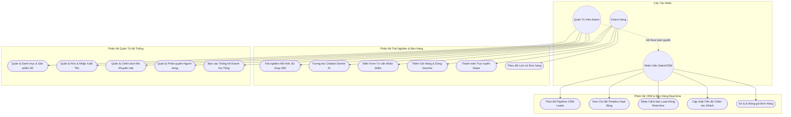
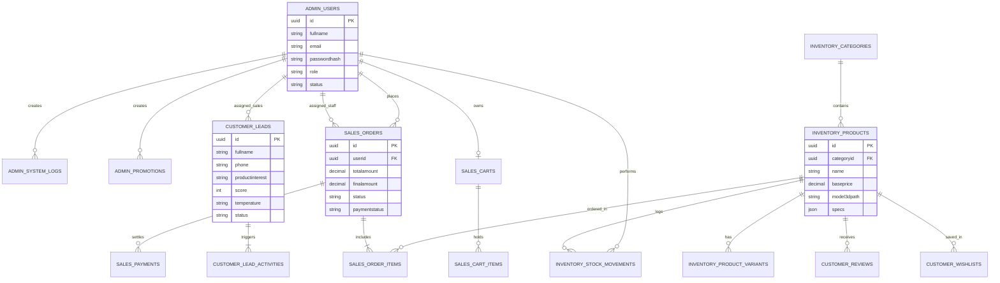
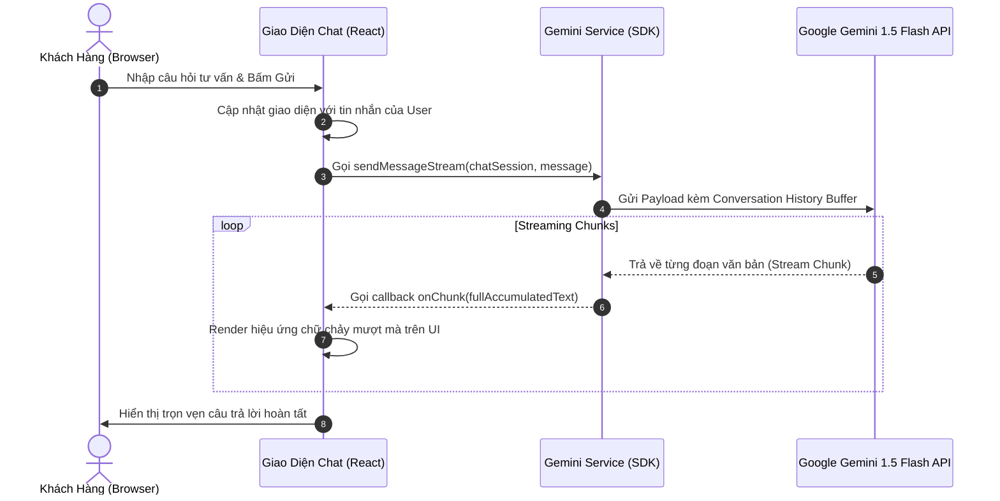
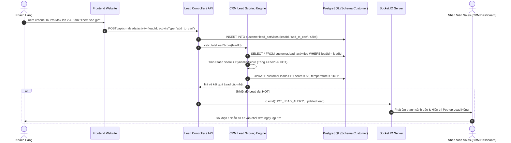
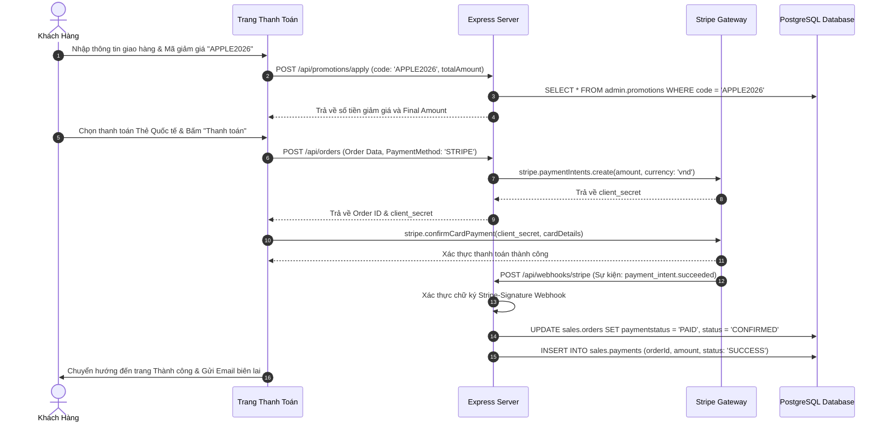

# CHƯƠNG 3: PHÂN TÍCH VÀ THIẾT KẾ HỆ THỐNG

---

## 3.1. Phân tích Yêu cầu Nghiệp vụ và Yêu cầu Phi chức năng

### 3.1.1. Yêu cầu chức năng cho Khách hàng (Customer Requirements)
Khách hàng là đối tượng người dùng cuối tiếp xúc trực tiếp với giao diện mua sắm và các trải nghiệm công nghệ cao trên website. Các chức năng phục vụ khách hàng bao gồm:

```
┌─────────────────────────────────────────────────────────────────────────────┐
│                 BẢNG PHÂN RÃ CHỨC NĂNG PHÂN HỆ KHÁCH HÀNG                   │
├─────────┬───────────────────────────┬───────────────────────────────────────┤
│ Mã YC   │ Tên chức năng             │ Mô tả chi tiết nghiệp vụ              │
├─────────┼───────────────────────────┼───────────────────────────────────────┤
│ YC-C01  │ Trải nghiệm không gian 3D │ Xoay 360°, phóng to/thu nhỏ mô hình   │
│         │ trực quan hóa sản phẩm    │ MacBook, iPhone, iPad thời gian thực  │
├─────────┼───────────────────────────┼───────────────────────────────────────┤
│ YC-C02  │ Trò chuyện Trợ lý ảo AI   │ Nhắn tin hỏi đáp 24/7 với Gemini AI,  │
│         │ (Streaming AI Chatbot)    │ nhận tư vấn cấu hình, so sánh máy     │
├─────────┼───────────────────────────┼───────────────────────────────────────┤
│ YC-C03  │ Tìm kiếm và Lọc sản phẩm  │ Tìm theo từ khóa, lọc theo danh mục,  │
│         │ thông minh                │ khoảng giá, dung lượng, màu sắc       │
├─────────┼───────────────────────────┼───────────────────────────────────────┤
│ YC-C04  │ Đăng ký nhận tư vấn       │ Điền form nhu cầu (sản phẩm, ngân     │
│         │ (Lead Form Submission)    │ sách, số điện thoại) để nhận ưu đãi   │
├─────────┼───────────────────────────┼───────────────────────────────────────┤
│ YC-C05  │ Quản lý Giỏ hàng mua sắm  │ Thêm/xóa/sửa số lượng, chọn màu sắc   │
│         │ (Multi-item Cart)         │ và phiên bản dung lượng bộ nhớ        │
├─────────┼───────────────────────────┼───────────────────────────────────────┤
│ YC-C06  │ Áp dụng Voucher giảm giá  │ Nhập mã khuyến mãi, kiểm tra hợp lệ,  │
│         │ (Promotion Engine)        │ tự động tính chiết khấu đơn hàng      │
├─────────┼───────────────────────────┼───────────────────────────────────────┤
│ YC-C07  │ Thanh toán trực tuyến     │ Thanh toán thẻ Visa/MasterCard bảo mật│
│         │ bảo mật qua Stripe        │ thông qua cổng thanh toán Stripe      │
├─────────┼───────────────────────────┼───────────────────────────────────────┤
│ YC-C08  │ Quản lý Tài khoản cá nhân │ Đăng ký, đăng nhập JWT, đổi thông tin │
│         │ và Lịch sử đơn hàng       │ cá nhân, theo dõi trạng thái đơn hàng │
├─────────┼───────────────────────────┼───────────────────────────────────────┤
│ YC-C09  │ Đánh giá & Danh sách thích│ Gửi đánh giá sao, bình luận sản phẩm, │
│         │ (Review & Wishlist)       │ lưu sản phẩm yêu thích vào Wishlist   │
└─────────┴───────────────────────────┴───────────────────────────────────────┘
```

### 3.1.2. Yêu cầu chức năng cho Đội ngũ Kinh doanh & Marketing (Staff/Sales)
Nhân viên kinh doanh và chuyên viên tiếp thị cần các công cụ thông minh để theo dõi hành vi khách hàng và tối ưu hóa quy trình chốt đơn:

```
┌─────────────────────────────────────────────────────────────────────────────┐
│             BẢNG PHÂN RÃ CHỨC NĂNG PHÂN HỆ KINH DOANH & MARKETING           │
├─────────┬───────────────────────────┬───────────────────────────────────────┤
│ Mã YC   │ Tên chức năng             │ Mô tả chi tiết nghiệp vụ              │
├─────────┼───────────────────────────┼───────────────────────────────────────┤
│ YC-S01  │ Quản lý Khách tiềm năng   │ Xem danh sách Lead, lọc theo nhiệt độ │
│         │ (CRM Lead Pipeline)       │ (Cold/Warm/Hot) và trạng thái chăm sóc│
├─────────┼───────────────────────────┼───────────────────────────────────────┤
│ YC-S02  │ Xem Timeline Hành vi      │ Truy vết toàn bộ lịch sử vi mô: số lần│
│         │ (Lead Activity Tracking)  │ xem sản phẩm, thêm giỏ, click liên hệ │
├─────────┼───────────────────────────┼───────────────────────────────────────┤
│ YC-S03  │ Nhận cảnh báo Lead Nóng   │ Nhận thông báo âm thanh và pop-up tức │
│         │ thời gian thực (Socket.IO)│ thì khi có khách hàng đạt ngưỡng HOT  │
├─────────┼───────────────────────────┼───────────────────────────────────────┤
│ YC-S04  │ Cập nhật Trạng thái & Note│ Ghi chú nhật ký cuộc gọi, cập nhật tiến│
│         │ chăm sóc khách hàng       │ độ từ NEW -> CONTACTED -> WON / LOST  │
├─────────┼───────────────────────────┼───────────────────────────────────────┤
│ YC-S05  │ Xử lý Đơn hàng bán lẻ     │ Xem danh sách đơn hàng được phân công,│
│         │ (Order Fulfillment)       │ cập nhật trạng thái đóng gói, giao vận│
└─────────┴───────────────────────────┴───────────────────────────────────────┘
```

### 3.1.3. Yêu cầu chức năng cho Quản trị viên (Admin Requirements)
Quản trị viên hệ thống nắm toàn quyền kiểm soát cấu hình, dữ liệu và báo cáo tài chính:

```
┌─────────────────────────────────────────────────────────────────────────────┐
│                 BẢNG PHÂN RÃ CHỨC NĂNG PHÂN HỆ QUẢN TRỊ VIÊN                │
├─────────┬───────────────────────────┬───────────────────────────────────────┤
│ Mã YC   │ Tên chức năng             │ Mô tả chi tiết nghiệp vụ              │
├─────────┼───────────────────────────┼───────────────────────────────────────┤
│ YC-A01  │ Quản lý Người dùng & RBAC │ Tạo tài khoản nhân viên, phân quyền   │
│         │ (User & Role Management)  │ động (Admin, Staff, Sales, Customer)  │
├─────────┼───────────────────────────┼───────────────────────────────────────┤
│ YC-A02  │ Quản lý Danh mục & Sản phẩm│ Thêm, sửa, ẩn/hiện sản phẩm, cấu hình │
│         │ (Catalog & Variants CRUD) │ thông số kỹ thuật, hình ảnh, biến thể │
├─────────┼───────────────────────────┼───────────────────────────────────────┤
│ YC-A03  │ Quản lý Kho & Xuất nhập tồn│ Ghi nhận biến động nhập xuất kho hàng │
│         │ (Inventory & Stock Move)  │ (StockMovement), cảnh báo tồn kho thấp│
├─────────┼───────────────────────────┼───────────────────────────────────────┤
│ YC-A04  │ Quản lý Chiến dịch Khuyến mãi│ Tạo mã Voucher, thiết lập hạn sử dụng,│
│         │ (Promotion & Coupons)     │ giới hạn số lượt dùng và giá trị giảm │
├─────────┼───────────────────────────┼───────────────────────────────────────┤
│ YC-A05  │ Báo cáo Doanh thu & CRM   │ Dashboard trực quan: tổng doanh thu,  │
│         │ (Analytics Dashboard)     │ tỷ lệ chuyển đổi, biểu đồ đơn hàng    │
├─────────┼───────────────────────────┼───────────────────────────────────────┤
│ YC-A06  │ Tra cứu Nhật ký Hệ thống  │ Xem lịch sử thao tác của nhân viên    │
│         │ (Audit System Logs)       │ (SystemLog) phục vụ an toàn dữ liệu   │
└─────────┴───────────────────────────┴───────────────────────────────────────┘
```

### 3.1.4. Yêu cầu phi chức năng (Non-Functional Requirements)
1. **Hiệu năng (Performance):** 
   - Thời gian phản hồi API trung bình dưới $200\text{ms}$.
   - Tốc độ khung hình render 3D (Three.js Canvas) đạt từ $50 - 60\text{ FPS}$ trên các thiết bị phổ thông.
   - Thời gian trễ phản hồi từ khi khách hàng gửi tin nhắn AI đến khi nhận chunk đầu tiên dưới $1.2$ giây.
2. **Khả năng mở rộng (Scalability):** Cơ sở dữ liệu phân chia 4 Schema độc lập, hỗ trợ Connection Pooling của Prisma trên Neon Cloud để chịu tải hàng ngàn kết nối đồng thời.
3. **Bảo mật (Security):** Mật khẩu người dùng được băm Bcrypt; Token JWT có thời hạn hợp lý; Xác thực Webhook Stripe bằng mã bí mật; Chống các lỗ hổng phổ biến như SQL Injection (qua Prisma ORM) và XSS.
4. **Tính khả dụng (Availability & Usability):** Giao diện đáp ứng (Responsive Design) hoàn hảo trên mọi kích thước màn hình từ điện thoại di động ($375\text{px}$) đến màn hình siêu rộng ($4\text{K}$).

---

## 3.2. Thiết kế Mô hình Use Case và Phân quyền RBAC

### 3.2.1. Ma trận Phân quyền Kiểm soát Truy cập (RBAC Matrix)

```
┌─────────────────────────────────────────────────────────────────────────────┐
│                    MA TRẬN PHÂN QUYỀN HỆ THỐNG (RBAC MATRIX)                │
├───────────────────────────────────┬──────────────┬──────────────┬───────────┤
│ Chức năng / Quyền hạn             │ Customer     │ Staff/Sales  │ Admin     │
├───────────────────────────────────┼──────────────┼──────────────┼───────────┤
│ Trải nghiệm 3D & Chat Gemini AI   │ [x] Có       │ [x] Có       │ [x] Có    │
│ Thêm giỏ hàng & Đặt hàng Stripe   │ [x] Có       │ [x] Có       │ [x] Có    │
│ Xem lịch sử đơn hàng cá nhân      │ [x] Có       │ [x] Có       │ [x] Có    │
│ Quản lý danh sách CRM Leads       │ [ ] Không    │ [x] Có       │ [x] Có    │
│ Cập nhật tiến độ chăm sóc Lead    │ [ ] Không    │ [x] Có       │ [x] Có    │
│ Nhận thông báo Socket Lead Hot    │ [ ] Không    │ [x] Có       │ [x] Có    │
│ Xử lý trạng thái tất cả đơn hàng  │ [ ] Không    │ [x] Có       │ [x] Có    │
│ Thêm / Sửa / Xóa Sản phẩm & Giá   │ [ ] Không    │ [ ] Không    │ [x] Có    │
│ Quản lý Kho hàng (Nhập / Xuất)    │ [ ] Không    │ [ ] Không    │ [x] Có    │
│ Quản lý Mã giảm giá (Vouchers)    │ [ ] Không    │ [ ] Không    │ [x] Có    │
│ Quản lý Tài khoản & Phân quyền    │ [ ] Không    │ [ ] Không    │ [x] Có    │
│ Xem Doanh thu tổng & System Logs  │ [ ] Không    │ [ ] Không    │ [x] Có    │
└───────────────────────────────────┴──────────────┴──────────────┴───────────┘
```

### 3.2.2. Sơ đồ Use Case Tổng thể Hệ thống



---

## 3.3. Thiết kế Kiến trúc Hệ thống (System Architecture)

Hệ thống được tổ chức theo kiến trúc phân tầng 3 lớp (**3-Tier Architecture**) kết hợp kiến trúc hướng dịch vụ với sự tham gia của các nền tảng AI Cloud và Cổng thanh toán quốc tế:

```
┌─────────────────────────────────────────────────────────────────────────────┐
│                    KIẾN TRÚC TỔNG THỂ HỆ THỐNG (3-TIER ARCHITECTURE)        │
├─────────────────────────────────────────────────────────────────────────────┤
│                                                                             │
│  [ CLIENT TIER - TRÌNH DUYỆT NGƯỜI DÙNG ]                                   │
│  ┌─────────────────────────┐  ┌─────────────────────────┐  ┌─────────────┐  │
│  │ React 18 + Three.js     │  │ Gemini AI Chat Widget   │  │ CRM Back-   │  │
│  │ 3D Canvas / Shop Pages  │  │ Multi-turn Streaming    │  │ office Dash │  │
│  └────────────┬────────────┘  └────────────┬────────────┘  └──────┬──────┘  │
│               │                            │                      │         │
│               │ (HTTPS REST API / JSON)    │ (Socket.IO Events)   │         │
│               ▼                            ▼                      ▼         │
│  [ APPLICATION SERVER TIER - NODE.JS EXPRESS 5 BACKEND ]                    │
│  ┌───────────────────────────────────────────────────────────────────────┐  │
│  │ Middlewares: CORS | JWT Authentication | RBAC Authorize | Multer       │  │
│  ├───────────────────────────────────────────────────────────────────────┤  │
│  │ Controllers & Routers:                                                │  │
│  │ • AuthController       • ProductController      • OrderController     │  │
│  │ • CRMController        • ChatController         • WebhookController   │  │
│  ├───────────────────────────────────────────────────────────────────────┤  │
│  │ Business Logic & Services:                                            │  │
│  │ • CRM Lead Scoring Engine (Static & Dynamic Scoring + Inactivity)    │  │
│  │ • Socket.IO Gateway (Emit Hot Lead Alert, Order State Notifications) │  │
│  │ • Gemini AI Service Integration (Prompt & Stream Handler)            │  │
│  │ • Stripe Checkout & Webhook Signature Verifier                       │  │
│  └───────────────────────────────────┬───────────────────────────────────┘  │
│                                      │ (Prisma Client Multi-Schema Connection│
│                                      ▼  Pooling via PostgreSQL Driver)      │
│  [ DATA TIER - POSTGRESQL NEON SERVERLESS CLOUD ]                           │
│  ┌───────────────────────────────────────────────────────────────────────┐  │
│  │  SCHEMA: admin        │  SCHEMA: sales       │  SCHEMA: inventory     │  │
│  │  • users              │  • orders            │  • products            │  │
│  │  • system_logs        │  • order_items       │  • categories          │  │
│  │  • promotions         │  • payments          │  • product_variants    │  │
│  │  • permission_settings│  • carts/cart_items  │  • stock_movements     │  │
│  ├───────────────────────┴──────────────────────┴────────────────────────┤  │
│  │  SCHEMA: customer                                                     │  │
│  │  • leads              • lead_activities      • reviews   • wishlists  │  │
│  └───────────────────────────────────────────────────────────────────────┘  │
│                                                                             │
│  [ EXTERNAL CLOUD SERVICES ]                                                │
│  ┌─────────────────────────────────┐   ┌─────────────────────────────────┐  │
│  │ Google Generative AI Cloud      │   │ Stripe Payment Processing Cloud │  │
│  │ (Gemini 1.5 Flash Model)        │   │ (PCI-DSS Level 1 Safe Gateway)  │  │
│  └─────────────────────────────────┘   └─────────────────────────────────┘  │
└─────────────────────────────────────────────────────────────────────────────┘
```

---

## 3.4. Thiết kế Cơ sở Dữ liệu Chi tiết (4 Multi-Schemas)

Điểm nhấn kiến trúc cốt lõi của dự án là việc chia tách vật lý cơ sở dữ liệu thành 4 Schema chuyên biệt: `admin`, `sales`, `inventory`, `customer`. Thiết kế này đảm bảo tính độc lập dữ liệu, tối ưu hóa tốc độ truy vấn, dễ dàng bảo trì và phân quyền an toàn ở mức CSDL.

### 3.4.1. Lược đồ Schema `admin`

#### 1. Bảng `admin.users` (Tài khoản người dùng và nhân viên)
| Tên Cột | Kiểu Dữ liệu | Khóa | Cho phép NULL | Mô tả chi tiết |
| :--- | :--- | :--- | :--- | :--- |
| `id` | UUID | PK | NO | Mã định danh duy nhất (gen_random_uuid()) |
| `fullname` | VARCHAR(100) | | NO | Họ và tên đầy đủ của người dùng |
| `email` | VARCHAR(150) | UNIQUE | YES | Địa chỉ hòm thư điện tử đăng nhập |
| `passwordhash` | VARCHAR(255) | | NO | Chuỗi mật khẩu đã băm bằng Bcrypt |
| `phone` | VARCHAR(20) | | YES | Số điện thoại liên lạc |
| `dob` | DATE | | YES | Ngày tháng năm sinh |
| `address` | TEXT | | YES | Địa chỉ giao hàng mặc định |
| `gender` | VARCHAR(20) | | YES | Giới tính (male, female, other) |
| `notes` | TEXT | | YES | Ghi chú thêm về người dùng |
| `role` | VARCHAR(20) | | NO | Vai trò (customer, staff, admin) |
| `status` | VARCHAR(20) | | NO | Trạng thái (ACTIVE, INACTIVE, BLOCKED) |
| `createdat` | TIMESTAMP(6) | | YES | Thời điểm tạo tài khoản (Mặc định: now()) |
| `lastloginat` | TIMESTAMP(6) | | YES | Thời điểm đăng nhập gần nhất |

#### 2. Bảng `admin.system_logs` (Nhật ký kiểm toán hệ thống)
| Tên Cột | Kiểu Dữ liệu | Khóa | Cho phép NULL | Mô tả chi tiết |
| :--- | :--- | :--- | :--- | :--- |
| `id` | UUID | PK | NO | Mã định danh bản ghi log |
| `staffid` | UUID | FK | YES | Tham chiếu đến `admin.users.id` |
| `action` | VARCHAR(255) | | NO | Hành động thực hiện (CREATE, UPDATE, DELETE...) |
| `description`| TEXT | | YES | Chi tiết nội dung thao tác |
| `createdat` | TIMESTAMP(6) | | YES | Thời điểm phát sinh sự kiện |

#### 3. Bảng `admin.promotions` (Mã giảm giá và Chiến dịch khuyến mãi)
| Tên Cột | Kiểu Dữ liệu | Khóa | Cho phép NULL | Mô tả chi tiết |
| :--- | :--- | :--- | :--- | :--- |
| `id` | UUID | PK | NO | Mã định danh chương trình khuyến mãi |
| `code` | VARCHAR(50) | UNIQUE | NO | Mã code voucher (ví dụ: `APPLE2026`, `WELCOME10`) |
| `title` | VARCHAR(255) | | NO | Tiêu đề chương trình giảm giá |
| `description`| TEXT | | YES | Điều kiện và mô tả áp dụng voucher |
| `discounttype`| VARCHAR(20) | | NO | Loại giảm giá (`PERCENTAGE` hoặc `FIXED`) |
| `discountvalue`| DECIMAL(15,2)| | NO | Giá trị giảm (% hoặc số tiền cụ thể) |
| `maxdiscount`| DECIMAL(15,2)| | YES | Mức giảm tối đa (khi áp dụng %) |
| `minordervalue`| DECIMAL(15,2)| | NO | Giá trị đơn hàng tối thiểu để được áp dụng |
| `usagelimit` | INT | | YES | Giới hạn tổng số lượt sử dụng voucher |
| `usedcount` | INT | | NO | Số lượt đã sử dụng (Mặc định: 0) |
| `validfrom` | TIMESTAMP(6) | | YES | Thời điểm bắt đầu có hiệu lực |
| `validuntil` | TIMESTAMP(6) | | YES | Thời điểm hết hạn voucher |
| `isactive` | BOOLEAN | | NO | Trạng thái kích hoạt (TRUE/FALSE) |
| `createdby` | UUID | FK | YES | Người tạo khuyến mãi (`admin.users.id`) |
| `createdat` | TIMESTAMP(6) | | YES | Ngày tạo mã khuyến mãi |

#### 4. Bảng `admin.permission_settings` (Cấu hình phân quyền động)
| Tên Cột | Kiểu Dữ liệu | Khóa | Cho phép NULL | Mô tả chi tiết |
| :--- | :--- | :--- | :--- | :--- |
| `id` | UUID | PK | NO | Mã định danh quyền |
| `role` | VARCHAR(50) | UNIQUE | NO | Tên vai trò (admin, staff, sales...) |
| `permissions`| JSON | | NO | Mảng JSON chứa danh sách quyền được cấp |
| `updatedat` | TIMESTAMP(6) | | NO | Thời điểm cập nhật phân quyền gần nhất |

---

### 3.4.2. Lược đồ Schema `sales`

#### 1. Bảng `sales.orders` (Đơn đặt hàng)
| Tên Cột | Kiểu Dữ liệu | Khóa | Cho phép NULL | Mô tả chi tiết |
| :--- | :--- | :--- | :--- | :--- |
| `id` | UUID | PK | NO | Mã định danh đơn hàng duy nhất |
| `userid` | UUID | FK | YES | Khách hàng đặt mua (`admin.users.id`) |
| `totalamount`| DECIMAL(15,2)| | NO | Tổng số tiền đơn hàng trước giảm giá |
| `discountamount`| DECIMAL(15,2)| | NO | Số tiền được giảm giá qua voucher |
| `finalamount`| DECIMAL(15,2)| | NO | Số tiền thanh toán cuối cùng |
| `promotioncode`| VARCHAR(50) | | YES | Mã voucher đã áp dụng |
| `status` | VARCHAR(50) | | NO | Trạng thái (`PENDING`, `CONFIRMED`, `SHIPPING`, `DELIVERED`, `CANCELLED`) |
| `paymentstatus`| VARCHAR(50)| | NO | Trạng thái thanh toán (`UNPAID`, `PAID`, `REFUNDED`) |
| `paymentmethod`| VARCHAR(50)| | NO | Phương thức (`STRIPE`, `COD`, `BANK_TRANSFER`) |
| `shippingaddress`| TEXT | | NO | Địa chỉ nhận hàng |
| `receivername`| VARCHAR(100)| | NO | Tên người nhận hàng |
| `receiverphone`| VARCHAR(20) | | NO | Số điện thoại người nhận hàng |
| `notes` | TEXT | | YES | Ghi chú đơn hàng của khách |
| `assignedto` | UUID | FK | YES | Nhân viên phụ trách xử lý (`admin.users.id`) |
| `createdat` | TIMESTAMP(6) | | YES | Thời điểm đặt hàng |
| `updatedat` | TIMESTAMP(6) | | YES | Thời điểm cập nhật trạng thái đơn |

#### 2. Bảng `sales.order_items` (Chi tiết mặt hàng trong đơn)
| Tên Cột | Kiểu Dữ liệu | Khóa | Cho phép NULL | Mô tả chi tiết |
| :--- | :--- | :--- | :--- | :--- |
| `id` | UUID | PK | NO | Mã định danh dòng chi tiết đơn hàng |
| `orderid` | UUID | FK | NO | Tham chiếu đến `sales.orders.id` |
| `productid` | UUID | FK | NO | Tham chiếu đến `inventory.products.id` |
| `variantid` | UUID | FK | YES | Tham chiếu biến thể `inventory.product_variants.id` |
| `quantity` | INT | | NO | Số lượng sản phẩm đặt mua |
| `unitprice` | DECIMAL(15,2)| | NO | Đơn giá tại thời điểm đặt mua |
| `totalprice` | DECIMAL(15,2)| | NO | Tổng tiền dòng (`quantity * unitprice`) |

#### 3. Bảng `sales.payments` (Giao dịch thanh toán)
| Tên Cột | Kiểu Dữ liệu | Khóa | Cho phép NULL | Mô tả chi tiết |
| :--- | :--- | :--- | :--- | :--- |
| `id` | UUID | PK | NO | Mã định danh giao dịch thanh toán |
| `orderid` | UUID | FK | NO | Tham chiếu đến `sales.orders.id` |
| `paymentmethod`| VARCHAR(50)| | NO | Cổng thanh toán (`STRIPE`, `COD`...) |
| `transactionid`| VARCHAR(255)| | YES | Mã giao dịch từ Stripe (`pi_xxxx...`) |
| `amount` | DECIMAL(15,2)| | NO | Số tiền giao dịch thực tế |
| `status` | VARCHAR(50) | | NO | Trạng thái (`PENDING`, `SUCCESS`, `FAILED`) |
| `paymentpayload`| JSON | | YES | Dữ liệu phản hồi chi tiết từ Webhook Stripe |
| `createdat` | TIMESTAMP(6) | | YES | Thời điểm thực hiện thanh toán |

#### 4. Bảng `sales.carts` & `sales.cart_items` (Giỏ hàng người dùng)
- `sales.carts`: Lưu trữ giỏ hàng gắn với `userId` (quan hệ 1-1).
- `sales.cart_items`: Lưu các mặt hàng trong giỏ, gồm `cartId`, `productId`, `variantId`, `quantity`.

---

### 3.4.3. Lược đồ Schema `inventory`

#### 1. Bảng `inventory.categories` (Danh mục sản phẩm)
| Tên Cột | Kiểu Dữ liệu | Khóa | Cho phép NULL | Mô tả chi tiết |
| :--- | :--- | :--- | :--- | :--- |
| `id` | UUID | PK | NO | Mã định danh danh mục |
| `name` | VARCHAR(100) | | NO | Tên danh mục (iPhone, Mac, iPad, Phụ kiện) |
| `slug` | VARCHAR(100) | UNIQUE | NO | Đường dẫn thân thiện SEO (iphone, macbook...) |
| `description`| TEXT | | YES | Mô tả ngắn về danh mục sản phẩm |
| `image` | VARCHAR(255) | | YES | Ảnh đại diện danh mục |

#### 2. Bảng `inventory.products` (Thông tin sản phẩm chính)
| Tên Cột | Kiểu Dữ liệu | Khóa | Cho phép NULL | Mô tả chi tiết |
| :--- | :--- | :--- | :--- | :--- |
| `id` | UUID | PK | NO | Mã định danh sản phẩm |
| `categoryid` | UUID | FK | YES | Thuộc danh mục `inventory.categories.id` |
| `name` | VARCHAR(255) | | NO | Tên sản phẩm (iPhone 16 Pro Max, MacBook Pro M3) |
| `slug` | VARCHAR(255) | UNIQUE | NO | Slug chuẩn URL |
| `description`| TEXT | | YES | Mô tả chi tiết sản phẩm và tính năng |
| `baseprice` | DECIMAL(15,2)| | NO | Giá gốc niêm yết |
| `saleprice` | DECIMAL(15,2)| | YES | Giá khuyến mãi |
| `thumbnail` | VARCHAR(255) | | YES | Ảnh đại diện chính |
| `images` | TEXT[] | | YES | Mảng danh sách đường dẫn ảnh bổ sung |
| `model3dpath`| VARCHAR(255) | | YES | Đường dẫn file mô hình 3D (.gltf / .glb) |
| `specs` | JSON | | YES | Thông số kỹ thuật chi tiết (Chip, RAM, Màn hình...) |
| `status` | VARCHAR(20) | | NO | Trạng thái (`ACTIVE`, `OUT_OF_STOCK`, `HIDDEN`) |
| `isfeatured` | BOOLEAN | | NO | Đánh dấu sản phẩm nổi bật (TRUE/FALSE) |
| `createdat` | TIMESTAMP(6) | | YES | Ngày tạo sản phẩm |

#### 3. Bảng `inventory.product_variants` (Biến thể màu sắc và dung lượng)
| Tên Cột | Kiểu Dữ liệu | Khóa | Cho phép NULL | Mô tả chi tiết |
| :--- | :--- | :--- | :--- | :--- |
| `id` | UUID | PK | NO | Mã định danh biến thể |
| `productid` | UUID | FK | NO | Tham chiếu sản phẩm cha `inventory.products.id` |
| `color` | VARCHAR(50) | | YES | Màu sắc (Titan Tự nhiên, Đen Không gian, Bạc...) |
| `storage` | VARCHAR(50) | | YES | Dung lượng bộ nhớ (128GB, 256GB, 512GB, 1TB) |
| `sku` | VARCHAR(100) | UNIQUE | NO | Mã quản lý kho duy nhất (SKU) |
| `price` | DECIMAL(15,2)| | NO | Giá bán áp dụng cho biến thể này |
| `stock` | INT | | NO | Số lượng tồn kho hiện tại (Mặc định: 0) |

#### 4. Bảng `inventory.stock_movements` (Lịch sử biến động tồn kho)
| Tên Cột | Kiểu Dữ liệu | Khóa | Cho phép NULL | Mô tả chi tiết |
| :--- | :--- | :--- | :--- | :--- |
| `id` | UUID | PK | NO | Mã định danh giao dịch kho |
| `productid` | UUID | FK | NO | Tham chiếu `inventory.products.id` |
| `variantid` | UUID | FK | YES | Tham chiếu `inventory.product_variants.id` |
| `movementtype`| VARCHAR(20)| | NO | Loại biến động (`IMPORT`, `EXPORT`, `ADJUST`) |
| `quantity` | INT | | NO | Số lượng thay đổi |
| `reason` | TEXT | | YES | Lý do (Nhập hàng mới, Xuất đơn hàng, Kiểm kê) |
| `createdby` | UUID | FK | YES | Nhân viên thực hiện (`admin.users.id`) |
| `createdat` | TIMESTAMP(6) | | YES | Thời điểm ghi nhận giao dịch kho |

---

### 3.4.4. Lược đồ Schema `customer`

#### 1. Bảng `customer.leads` (Khách hàng tiềm năng CRM)
| Tên Cột | Kiểu Dữ liệu | Khóa | Cho phép NULL | Mô tả chi tiết |
| :--- | :--- | :--- | :--- | :--- |
| `id` | UUID | PK | NO | Mã định danh duy nhất của Lead |
| `fullname` | VARCHAR(100) | | NO | Họ tên người đăng ký tư vấn |
| `phone` | VARCHAR(20) | | YES | Số điện thoại liên hệ |
| `email` | VARCHAR(150) | | YES | Hòm thư điện tử |
| `productinterest`| VARCHAR(255)| | YES | Sản phẩm quan tâm (iPhone 16 Pro Max, Mac...) |
| `budgetrange`| VARCHAR(50) | | YES | Phân khúc ngân sách (`<10tr`, `10-30tr`, `>30tr`) |
| `status` | VARCHAR(50) | | NO | Tiến độ (`NEW`, `CONTACTED`, `QUALIFIED`, `WON`, `LOST`) |
| `temperature`| VARCHAR(20) | | NO | Nhiệt độ Lead (`COLD`, `WARM`, `HOT`) |
| `score` | INT | | NO | Tổng điểm Lead do Engine tính (Mặc định: 0) |
| `source` | VARCHAR(50) | | YES | Nguồn Lead (`WEB_POPUP`, `CHAT_AI`, `CHECKOUT`...) |
| `assignedto` | UUID | FK | YES | Nhân viên Sales phụ trách (`admin.users.id`) |
| `notes` | TEXT | | YES | Ghi chú quá trình tư vấn |
| `createdat` | TIMESTAMP(6) | | YES | Thời điểm tiếp nhận Lead |
| `updatedat` | TIMESTAMP(6) | | YES | Thời điểm cập nhật gần nhất |

#### 2. Bảng `customer.lead_activities` (Lịch sử hành vi vi mô của Lead)
| Tên Cột | Kiểu Dữ liệu | Khóa | Cho phép NULL | Mô tả chi tiết |
| :--- | :--- | :--- | :--- | :--- |
| `id` | UUID | PK | NO | Mã định danh hoạt động |
| `leadid` | UUID | FK | NO | Tham chiếu đến `customer.leads.id` |
| `activitytype`| VARCHAR(50)| | NO | Loại hành vi (`form_submit`, `view_product`, `add_to_cart`, `click_call`...) |
| `scoredelta` | INT | | NO | Điểm cộng/trừ cho hành vi tương ứng |
| `metadata` | JSON | | YES | Dữ liệu chi tiết kèm theo (Tên trang, IP, Device) |
| `createdat` | TIMESTAMP(6) | | YES | Thời điểm phát sinh hành vi |

#### 3. Bảng `customer.reviews` & `customer.wishlists`
- `customer.reviews`: Lưu đánh giá số sao (1-5), nội dung bình luận, gắn với `userId` và `productId`.
- `customer.wishlists`: Lưu danh sách sản phẩm yêu thích của khách hàng.

---

### 3.4.5. Sơ đồ Quan hệ Thực thể Toàn cục (Global ERD)



---

## 3.5. Thiết kế Biểu đồ Tuần tự (Sequence Diagrams)

### 3.5.1. Luồng Trò chuyện Tư vấn cùng Trợ lý Ảo Gemini AI Streaming



### 3.5.2. Luồng Thu thập Hành vi, Chấm điểm Tự động và Báo động Lead Nóng



### 3.5.3. Luồng Đặt hàng, Áp dụng Voucher và Thanh toán Cổng Stripe



---

## 3.6. Thiết kế Đặc tả Giao diện Lập trình Ứng dụng (RESTful APIs)

Hệ thống cung cấp danh mục API RESTful toàn diện, sử dụng chuẩn định dạng JSON cho việc trao đổi dữ liệu:

```
┌─────────────────────────────────────────────────────────────────────────────┐
│                    DANH MỤC ĐẶC TẢ CÁC ENDPOINT RESTFUL API CHÍNH           │
├───────┬───────────────────────────────┬──────────────┬──────────────────────┤
│ Method│ Endpoint URI                  │ Quyền hạn    │ Chức năng nghiệp vụ  │
├───────┼───────────────────────────────┼──────────────┼──────────────────────┤
│ POST  │ /api/auth/register            │ Public       │ Đăng ký tài khoản    │
│ POST  │ /api/auth/login               │ Public       │ Đăng nhập lấy JWT    │
│ GET   │ /api/auth/profile             │ User/Staff   │ Lấy thông tin cá nhân│
├───────┼───────────────────────────────┼──────────────┼──────────────────────┤
│ GET   │ /api/products                 │ Public       │ Danh sách sản phẩm 3D│
│ GET   │ /api/products/:slug           │ Public       │ Chi tiết SP & Model  │
│ POST  │ /api/products                 │ Admin        │ Thêm sản phẩm mới    │
│ PUT   │ /api/products/:id             │ Admin        │ Cập nhật sản phẩm    │
├───────┼───────────────────────────────┼──────────────┼──────────────────────┤
│ POST  │ /api/promotions/apply         │ Public/User  │ Kiểm tra & áp Voucher│
│ POST  │ /api/orders                   │ User         │ Tạo đơn hàng mới     │
│ GET   │ /api/orders/my-orders         │ User         │ Xem lịch sử mua sắm  │
│ PUT   │ /api/orders/:id/status        │ Staff/Admin  │ Cập nhật trạng thái  │
├───────┼───────────────────────────────┼──────────────┼──────────────────────┤
│ POST  │ /api/crm/leads                │ Public       │ Tiếp nhận Lead mới   │
│ GET   │ /api/crm/leads                │ Staff/Admin  │ Lấy danh sách Leads  │
│ POST  │ /api/crm/leads/activity       │ Public/User  │ Ghi nhận hành vi vi mô│
│ PUT   │ /api/crm/leads/:id            │ Staff/Admin  │ Cập nhật Lead & Note │
│ GET   │ /api/crm/dashboard/stats      │ Admin        │ Thống kê doanh thu   │
├───────┼───────────────────────────────┼──────────────┼──────────────────────┤
│ POST  │ /api/webhooks/stripe          │ Stripe Webhook| Đồng bộ giao dịch thẻ│
└───────┴───────────────────────────────┴──────────────┴──────────────────────┘
```

---

## 3.7. Kết luận Chương 3
Chương 3 đã hoàn thiện đầy đủ bản vẽ thiết kế kỹ thuật từ yêu cầu chức năng, phân quyền RBAC, kiến trúc 3 tầng phân tán, cấu trúc CSDL 4 Schemas chi tiết kèm từ điển dữ liệu chuẩn mực, các biểu đồ tuần tự tương tác thời gian thực và danh mục đặc tả API RESTful. Đây là kim chỉ nam trực tiếp để tiến hành hiện thực hóa mã nguồn trong Chương 4.
